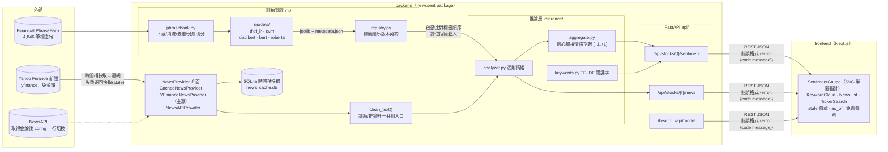

# 系統架構

## 整體架構圖

## 五條架構原則的落點

| 原則 | 落點 |
|---|---|
| 單一 Python package | `newssent/` 可安裝（`pip install -e .`），uvicorn 與 pytest import 路徑一致 |
| 新聞來源藏介面後 | `NewsProvider`＋`CachedNewsProvider` 共用「時間桶快取→連網→stale 降級」；yfinance/NewsAPI 只差 `_fetch()`，`config.NEWS_PROVIDER` 一行切換 |
| 訓練產物版本契約 | `registry.py` metadata 記錄**標籤順序**等設定，API 啟動比對——標籤錯位不報錯、只默默輸出相反情緒，此為第二道防線（第一道是 base.py 固定輸出順序） |
| 文字前處理單一入口 | `clean_text()`；`test_preprocess.py` 保證訓練/推論 parity |
| 設定單一事實來源 | `config.py`：標籤順序、切分 seed、快取 TTL、指數公式參數 |

## 情緒指數公式

`score = Σ(sign(label) × confidence) / n`，映射 [−1, +1]；
`|score| > 0.15`（`SENTIMENT_LABEL_THRESHOLD`）才判定正/負，否則中性。
neutral 的 sign 為 0——中性新聞稀釋指數但不貢獻極性。

## 資料流（一次 /sentiment 請求）

1. `deps.py` 正規驗證 ticker（`^[A-Z]{1,5}(\.[A-Z])?$`，防注入與路徑穿越）
2. Provider 取新聞（同 ticker 一小時內只打一次外部源；失敗退回快取並標 `stale: true`）
3. 逐則標題 `clean_text()` → BERT 批次推論 → 逐則 (label, confidence)
4. `aggregate.py` 算指數、`keywords.py` 算關鍵字（剔除停用詞與代號）
5. 回傳 `{score, label, article_count, keywords, model_version, as_of, stale}`

> 環境備註：專案路徑含中文時 libcurl 讀不到 venv 內 CA 憑證，
> `config.py` 啟動時自動複製 cacert.pem 至 ASCII 路徑並設 `CURL_CA_BUNDLE`。
