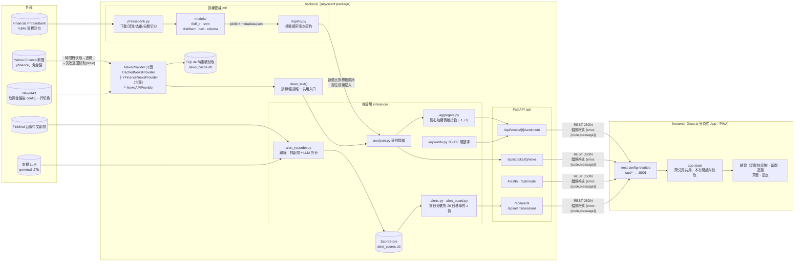

# 系統架構

## 整體架構圖

## 前端

- **一個 root layout、五個分頁**：`/` 總覽、`/news`、`/watchlist`、`/alerts`、`/settings`。
  手機（< 1024px）是底部分頁列，電腦是左側欄；切分頁走 client-side navigation，共用狀態不會重建。
- **只連前端**：瀏覽器打同源 `/api/*`，由 `next.config.ts` 轉送到 FastAPI（`API_PROXY_TARGET`）。
  手機只要能連到前端即可，後端不必開在區網、也不必改 CORS。
- **快取與限流**：後端限流是每 IP 每分鐘 30 次、所有端點共用，而經轉送後所有裝置都是同一個 IP。
  所以 `lib/app-state.tsx` 把各標的的情緒與新聞留在本次開啟內，追蹤清單與模型資訊等到有分頁用到才抓、只抓一次；
  預警分頁看過的日期也留在模組層快取。
- **偏好存在瀏覽器**：目前標的、最近查詢、主題存 localStorage（`lib/local-store.ts`，`useSyncExternalStore` 包裝；
  無痕模式等讀寫失敗時退回記憶體）。預設深色。
- **PWA**：`app/manifest.ts` ＋ `app/icon.tsx`、`app/apple-icon.tsx`、`app/icons/[variant]`（192／512／maskable）。
  沒有 service worker、不做離線快取。

## 資料流（預警分頁）

1. `alert_recorder` 離線執行：FinMind 抓 49 檔的中文標題 → 濾掉盤勢報導標題 → LLM 逐則評分 → 寫入 `alert_scores.db`
2. `/api/alerts/sessions` 回可查詢的交易日（已確認交易日＋推估到下一個尚未開盤的交易日）；前端用它切換日期
3. `/api/alerts?as_of=…` 只讀分數庫：開盤前可得標題的平均分數，對前 20 個交易日算 z 值（< −1.5 留意、< −2 高度異常）
4. 請求路徑上不打外部 API、不跑 LLM；分數庫沒跑 recorder 的日子會回「資料不足」並附原因

## 五條架構原則的落點

| 原則 | 落點 |
|---|---|
| 單一 Python package | `newssent/` 可安裝（`pip install -e .`），uvicorn 與 pytest import 路徑一致 |
| 新聞來源藏介面後 | `NewsProvider`＋`CachedNewsProvider` 共用「時間桶快取→連網→stale 降級」；yfinance/NewsAPI 只差 `_fetch()`，`config.NEWS_PROVIDER` 一行切換 |
| 訓練產物版本契約 | `registry.py` metadata 記錄**標籤順序**等設定，API 啟動比對——標籤錯位不報錯、只默默輸出相反情緒，此為第二道防線（第一道是 base.py 固定輸出順序） |
| 文字前處理單一入口 | `clean_text()`；`test_preprocess.py` 保證訓練/推論 parity |
| 設定單一事實來源 | `config.py`：標籤順序、切分 seed、快取 TTL、指數公式參數 |

## 情緒指數公式

`score = Σ(sign(label) × confidence) / n`，映射 [−1, +1]；
`|score| > 0.15`（`SENTIMENT_LABEL_THRESHOLD`）才判定正/負，否則中性。
neutral 的 sign 為 0——中性新聞稀釋指數但不貢獻極性。

## 資料流（一次 /sentiment 請求）

1. `deps.py` 正規驗證 ticker（`^[A-Z]{1,5}(\.[A-Z])?$`，防注入與路徑穿越）
2. Provider 取新聞（同 ticker 一小時內只打一次外部源；失敗退回快取並標 `stale: true`）
3. 逐則標題 `clean_text()` → BERT 批次推論 → 逐則 (label, confidence)
4. `aggregate.py` 算指數、`keywords.py` 算關鍵字（剔除停用詞與代號）
5. 回傳 `{score, label, article_count, keywords, model_version, as_of, stale}`

> 環境備註：專案路徑含中文時 libcurl 讀不到 venv 內 CA 憑證，
> `config.py` 啟動時自動複製 cacert.pem 至 ASCII 路徑並設 `CURL_CA_BUNDLE`。
